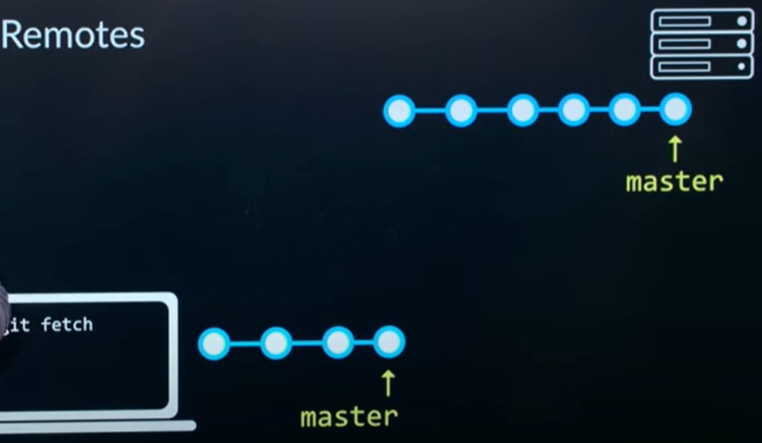
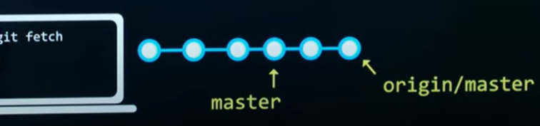
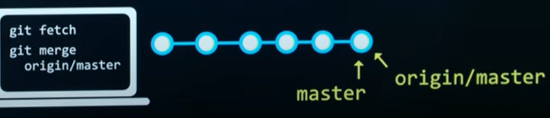

[廖雪峰git教程](https://www.liaoxuefeng.com/wiki/896043488029600)

>版本库 repository，你可以简单理解成一个目录，这个目录里面的所有文件都可以被Git管理起来，每个文件的修改、删除，Git都能跟踪，以便任何时刻都可以追踪历史，或者在将来某个时刻可以“还原”。

# 创建一个版本库，添加，提交
```bash
dengy git $ mkdir ml_notes
dengy git $ cd ml_notes/
dengy ml_notes $ pwd
/d/Users/Documents/git/ml_notes
dengy ml_notes $ git init
Initialized empty Git repository in D:/Users/Documents/git/ml_notes/.git/
dengy (master \#) ml_notes $ ls -a
./  ../  .git/
dengy (master \#) ml_notes $ touch README.md
dengy (master \#) ml_notes $ np README.md
dengy (master \#) ml_notes $ touch Ud-1-naive-bayes朴素贝叶斯.md
dengy (master \#) ml_notes $ git add README.md Ud-1-naive-bayes朴素贝叶斯.md
dengy (master +) ml_notes $ git commit -m "add 2 files"
[master (root-commit) f19e73f] add 2 files
 2 files changed, 7 insertions(+)
 create mode 100644 README.md
 create mode 100644 "Ud-1-naive-bayes\346\234\264\347\264\240\350\264\235\345\217\266\346\226\257.md"
 
```
随时掌握工作区的状态，使用`git status`命令，`git diff`查看修改内容。
`git log`命令显示从最近到最远的提交日志。可加`--pretty=oneline`参数简化输出。

### 工作区和暂存区


# 添加远程库
在github new repository，Repository name填入`ml_notes`，然后create。把本地仓库与之关联。
```bash
dengy (master) ml_notes $ git remote add origin git@github.com:eyedeng/ml_notes.git  
dengy (master) ml_notes $ git push -u origin master
```
此后，每次本地提交后，只要有必要，就可以使用命令`git push origin master`推送最新修改。若只有唯一远程分支，可省略为`git push`

# 从远程库克隆到本地
`git clone 仓库的地址`  
Git支持多种协议，包括https，但通过ssh支持的原生git协议速度最快。

# 从远程库同步到本地
```bash
dengy (master) ml_notes $ git remote -v  # 查看
origin  git@github.com:eyedeng/ml_notes.git (fetch)
origin  git@github.com:eyedeng/ml_notes.git (push)
dengy (master) ml_notes $ git fetch origin master
dengy (master) ml_notes $ git merge origin/master
```
 

 

 

后两行可用`git pull origin master`代替。同理可省略为`git pull`。  
$ git pull <远程主机名> <远程分支名>:<本地分支名>  
$ git push <远程主机名> <本地分支名>:<远程分支名>

# 合并冲突
在网站上修改了文件，同时也在本地修改过，不能push, git pull后，还需手动merge conflicts。  
```
<<<<<<< HEAD
# 本地修改
la la la.
=======
# 合并冲突
在网站上修改了文件，同时也在本地修改过，git pull前，需merge conflicts。
line line.
>>>>>>> a353517291f97f8ee5513b6eca70d808ce9d86ad
```

# 检出分支
当多人编写、开发新特性时可创建新分支。
```sh
dengy (master) learngit $ git branch
* master
dengy (master) learngit $ git branch feature  # 建新分支
dengy (master) learngit $ git branch
  feature
* master
dengy (master) learngit $ git checkout feature  # 检出
dengy (feature) learngit $
```
在**feature**分支上的修改不会改变**master**(git log可知)。采用此分支，合并到**master**：(master) learngit $ `git merge feature`

# Fork & Pull Request
`fork`别人的仓库后，clone到本地，切换分支(也可在master)可以随意修改、提交，想别人拉取你的贡献代码，需发请求：`pull request`,经对方审查同意会`merge`到对方仓库。

# 配置
同一台电脑同时使用gitHub（个人）和gitLab（公司），创建.ssh/config，设置github和gitlab账号配置。公司账号在用户级别（--global），在github仓库项目目录下设置name、email（即--local，仓库级别）
```sh
git config user.name 'eyedeng'
git config user.email 'dengyan1912@outlook.com'
```